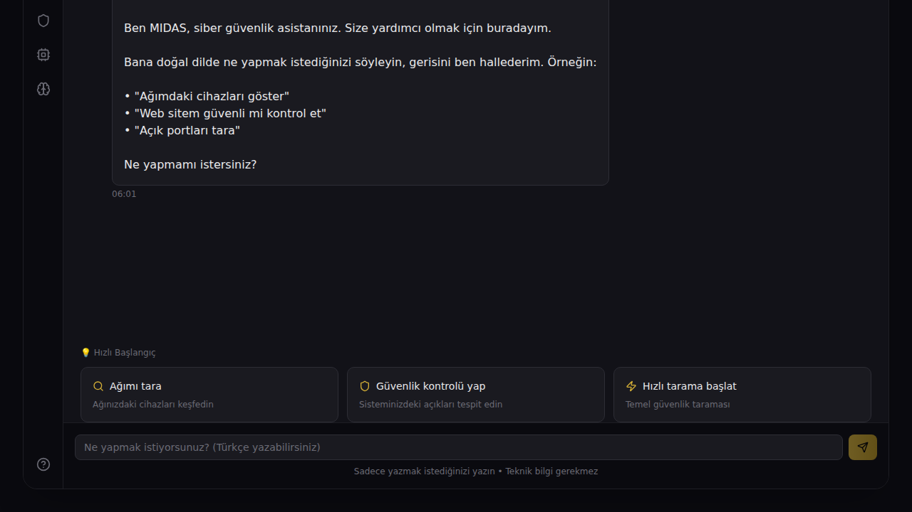
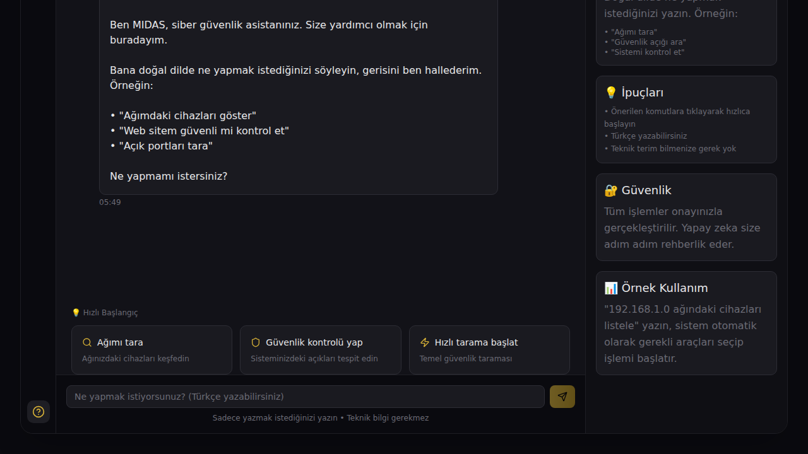

<p align="center">
  
</p>

<h1 align="center">🛡️ MIDAS Pro</h1>
<h3 align="center">Otonom Siber Operasyon Platformu</h3>

<p align="center">
  <strong>Doğal dil ile siber güvenlik operasyonlarını yönetin</strong>
</p>

<p align="center">
  
  
  
  
</p>

---

## 📖 Proje Hakkında

**MIDAS Pro**, siber güvenlik operasyonlarını herkes için erişilebilir kılmak amacıyla geliştirilmiş bir platformdur. Teknik bilgi gerektirmeden, doğal Türkçe komutlarla karmaşık güvenlik işlemlerini gerçekleştirebilirsiniz.

### 🎯 Misyonumuz

> *"Anne-babalar bile karmaşık mühendislik gerektiren eylemleri doğal dil girdisi ile gerçekleştirebilsin."*

Karmaşık güvenlik araçlarını anlaşılır ve basit bir arayüzde sunarak, siber güvenliği demokratikleştirmeyi hedefliyoruz.

---

## ✨ Özellikler

### 🗣️ Doğal Dil Desteği
Teknik terimler yerine günlük Türkçe kullanarak komut verin:
- ✅ "Ağımdaki cihazları göster"
- ✅ "Web sitem güvenli mi?"
- ✅ "Açık portları kontrol et"

### 🤖 Yapay Zeka Asistan
- Komutlarınızı anlayan akıllı asistan
- Adım adım rehberlik
- Otomatik araç seçimi

### 🎨 Basit ve Anlaşılır Arayüz
- Karmaşık menüler yok
- Sohbet tabanlı etkileşim
- Hızlı başlangıç kartları

### 🔐 Güvenli İşlem Akışı
- Tüm işlemler onayınızla başlar
- Şeffaf raporlama
- Risk uyarıları

---

## 📸 Ekran Görüntüleri

### Ana Ekran - Sohbet Arayüzü
<p align="center">
  
</p>

*Doğal dilde komut verin, MIDAS sizin için gerisini halleder.*

### Hızlı Başlangıç Kartları
<p align="center">
  
</p>

*Tek tıkla yaygın işlemlere başlayın.*

### Yardım Paneli
<p align="center">
  
</p>

*Her zaman yanınızda olan kullanım rehberi.*

---

## 🚀 Kurulum

### Gereksinimler
- Node.js 18 veya üzeri
- npm veya yarn

### Adımlar

1. **Projeyi klonlayın:**
```bash
git clone https://github.com/ksbicorp/Otonomsiberoperasyonarayz.git
cd Otonomsiberoperasyonarayz
```

2. **Bağımlılıkları yükleyin:**
```bash
npm install
```

3. **Geliştirme sunucusunu başlatın:**
```bash
npm run dev
```

4. **Tarayıcınızda açın:**
```
http://localhost:3000
```

---

## 📚 Kullanım Kılavuzu

### Başlarken

1. Uygulama açıldığında karşınıza **MIDAS Asistan** çıkar
2. Metin kutusuna ne yapmak istediğinizi yazın
3. Asistan size adım adım rehberlik eder
4. İşlemi onayladığınızda çalışmaya başlar

### Örnek Komutlar

| Ne Yapmak İstiyorsunuz? | Ne Yazmalısınız? |
|------------------------|------------------|
| Ağınızı taramak | "Ağımı tara" veya "Ağımdaki cihazları göster" |
| Güvenlik kontrolü | "Güvenlik kontrolü yap" veya "Sistem güvenli mi?" |
| Port taraması | "Açık portları kontrol et" |
| Hızlı analiz | "Hızlı tarama başlat" |

### İpuçları

- 💡 Türkçe yazabilirsiniz
- 💡 Teknik terim bilmenize gerek yok
- 💡 Hızlı başlangıç kartlarına tıklayarak başlayın
- 💡 Yardım için `?` butonuna tıklayın

---

## 🏗️ Teknik Altyapı

```
MIDAS Pro
├── Frontend (React + TypeScript)
│   ├── Sohbet Arayüzü
│   ├── Yapay Zeka Entegrasyonu
│   └── Kullanıcı Deneyimi Bileşenleri
│
├── UI Framework
│   ├── Tailwind CSS
│   ├── Radix UI Bileşenleri
│   └── Lucide İkonlar
│
└── Build Araçları
    └── Vite
```

---

## 🗂️ Proje Yapısı

```
Otonomsiberoperasyonarayz/
├── src/
│   ├── components/         # React bileşenleri
│   │   ├── ChatInterface.tsx   # Ana sohbet arayüzü
│   │   ├── SplashScreen.tsx    # Açılış ekranı
│   │   └── ui/                 # Temel UI bileşenleri
│   ├── assets/             # Görseller ve medya
│   ├── App.tsx             # Ana uygulama
│   └── main.tsx            # Giriş noktası
├── docs/
│   └── images/             # Dokümantasyon görselleri
├── package.json
├── vite.config.ts
└── README.md
```

---

## 🤝 Katkıda Bulunun

Projeye katkıda bulunmak isterseniz:

1. Bu depoyu fork edin
2. Yeni bir branch oluşturun (`git checkout -b ozellik/YeniOzellik`)
3. Değişikliklerinizi commit edin (`git commit -m 'Yeni özellik eklendi'`)
4. Branch'inizi push edin (`git push origin ozellik/YeniOzellik`)
5. Pull Request açın

---

## 📄 Lisans

Bu proje özel kullanım için geliştirilmiştir.

---

## 📞 İletişim

Sorularınız için:
- GitHub Issues üzerinden iletişime geçin
- Proje sayfasını ziyaret edin

---

<p align="center">
  <strong>🛡️ MIDAS Pro</strong><br>
  <em>Siber güvenliği herkes için erişilebilir kılıyoruz</em>
</p>
  